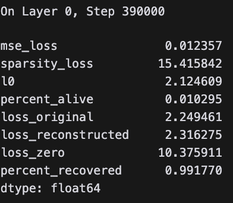
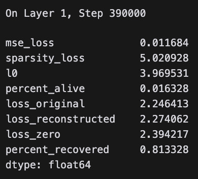
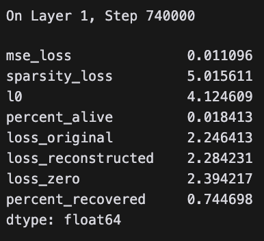
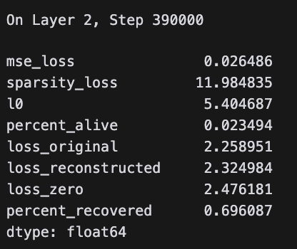
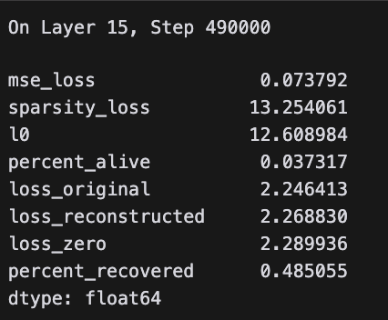

# Trained Sparse Autoencoders on Pythia 2.8B
I trained SAEs on the MLP_out activations of the Pythia 2.8B dataset. I trained using https://github.com/magikarp01/facts-sae.git, a fork of https://github.com/saprmarks/dictionary_learning.

## SAE Setup
- **Training Dataset**: Uncopyrighted Pile, at monology/pile-uncopyrighted
- **Model**: 32-layer Pythia 2.8B
- **Activation**: MLP_out
- **Layers Trained**: 0, 1, 2, 15
- **Batch Size**: 2048 for layer 15, 2560 for layers 0, 1, 2
- **Training Tokens**: 1e9 for layers 15, 0, 2, slightly less than 2e9 for layer 1
- **Training Steps**: 4e5 for layers 0, 2, 5e5 for layer 15, 7.5e5 for layer 1

## Training Hyperparamaters
- **Learning Rate**: 3e-4
- **Sparsity Penalty**: 1e-3
- **Warmup Steps**: 5000
- **Resample Steps**: 50000
- **Optimizer**: Constrained Adam
- **Scheduler**: LambdaLR, linear warmup lr between 0 and warmup_steps

## SAE Metrics

